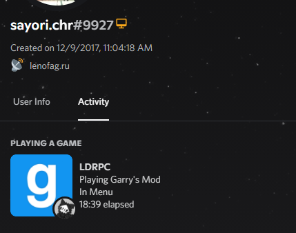
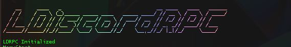
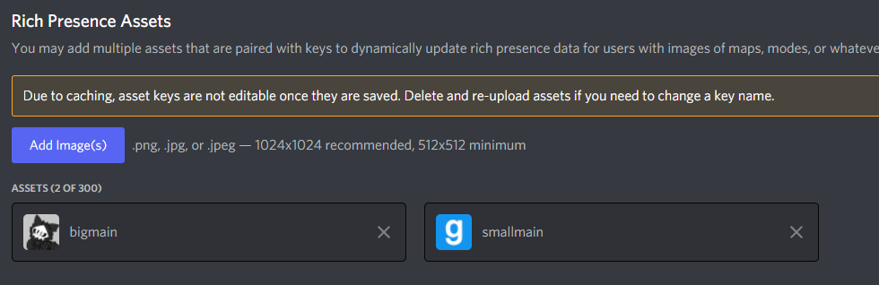

# LDiscordRPC
**LDiscordRPC** aka Lenofag's [Discord RPC](https://github.com/discord/discord-rpc) (Rich Presence) for **Garry's Mod**


## [Download](https://github.com/gerrustalker/LDiscordRPC/releases)
## Preview
\



## Installation
1. [Download](https://github.com/gerrustalker/LDiscordRPC/releases) the latest release
2. Put `gmsv_ldrpc_win32.dll` to `GarrysMod/garrysmod/lua/bin/` folder
3. Put `lua` folder to `Garrysmod/garrysmod/`

### Change image
Without recompiling, you will need to change `lua/menu/ldrpc.lua` at line **46**, like
```lua
LDRPC.Initialize("12345228133769420") -- YES, IN QUOTES!
```
At your [Discord Developer Portal](https://discord.com/developers/applications/) you will need to upload `smallmain` for **big image** and `bigmain` for **small image**: (i am too lazy to change it xd)



## Source compiling
*Note: this was compiled in Visual Studio 2019*
###
If you want to change default [Discord Application ID](https://discord.com/developers/applications/) and/or image keys:
* ID in `Discord.h` at line **9**
* Image in `Discord.cpp` at line **23** (large) and **25** (small)

### Dependencies:
* [DiscordRPC](https://github.com/Classic1338/DiscordRichPresence-) ([yes](https://www.unknowncheats.me/forum/general-programming-and-reversing/361227-adding-discord-rich-presence-cheat.html))
* [garrysmod-common](https://github.com/danielga/garrysmod_common) by [danielga](https://github.com/danielga/)

#### DiscordRPC:
1. Require `/include/`
2. Copy `/src/` folder to project (like [this](https://github.com/gerrustalker/LDiscordRPC/blob/main/images/discordrpcsrc.png))

#### garrysmod-common:
1. Download [premake5](https://premake.github.io/download)
2. Put premake5.exe to project folder
3. Open `cmd` in project folder, then write in `premake5.exe vs2019`
4. In new created folder named `project`, you will find your **solution file**


## Pasted?
### Yes.
* [unknowncheats.me](https://www.unknowncheats.me/forum/general-programming-and-reversing/361227-adding-discord-rich-presence-cheat.html) guide by [Warlock777888jr](https://www.unknowncheats.me/forum/members/1534130.html)
* [this](https://pastebin.com/yNMnHKzV) pastebin for timestamps

##
Please note, that this is my first C++ project.